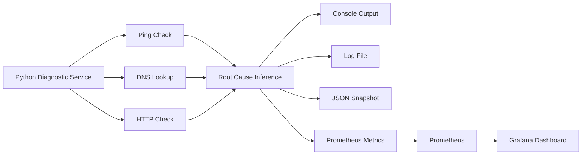

# 🌐 Network Diagnostics SRE


> Layered network diagnostics for SRE-style troubleshooting, with Prometheus metrics, Grafana dashboards, Dockerized execution, and machine-readable outputs.

---

## ✨ Overview

`Network Diagnostics SRE` is a small but complete troubleshooting tool designed to validate three operational layers:

- `NETWORK`: reachability through `ping`
- `DNS`: name resolution through `nslookup`
- `HTTP`: application availability through `requests`

The project is intentionally built as more than a script. It also exposes:

- structured logs
- JSON snapshots
- Prometheus metrics
- a preprovisioned Grafana dashboard
- Docker Compose infrastructure for local observability

---

## 🎯 Objectives

This repository aims to demonstrate a practical operational workflow:

- isolate failures by layer instead of checking only one symptom
- produce outputs for both humans and automation
- instrument the diagnostics process itself
- package the workflow so it can be reproduced locally with minimal setup

---

## 🧭 What It Detects

| Layer | Purpose | Example Failure |
|---|---|---|
| `NETWORK` | Verifies basic reachability | Host unreachable, missing ICMP path |
| `DNS` | Resolves hostnames to IPs | Invalid domain, resolver problem |
| `HTTP` | Confirms service response | Closed port, app down, timeout |

### Example conclusions

- `ROOT CAUSE: NO ISSUES DETECTED`
- `ROOT CAUSE: DNS RESOLUTION FAILURE`
- `ROOT CAUSE: SERVICE NOT RUNNING OR PORT CLOSED`
- `ROOT CAUSE: NETWORK REACHABILITY FAILURE`

---

## 🚀 Features

- Layer-by-layer diagnostics for `NETWORK`, `DNS`, and `HTTP`
- Automatic root cause classification
- Multi-host execution through `TARGET_HOSTS`
- Colored console output for quick scanning
- Structured logs in `logs/diagnostico_red.log`
- JSON snapshot export in `diagnostico_red_output.json`
- Prometheus `/metrics` endpoint
- Grafana dashboard with automatic provisioning
- Dockerized application and observability stack
- Unit tests for parsers and diagnostic logic

---

## 🏗️ Architecture



---

## 📦 Repository Structure

```text
ejercicio_2_diagnostico_red_sre/
├── diagnostico_red.py
├── requirements.txt
├── Dockerfile
├── docker-compose.yml
├── .dockerignore
├── .gitignore
├── .env.example
├── README.md
├── observability/
│   ├── prometheus/
│   │   └── prometheus.yml
│   └── grafana/
│       ├── dashboards/
│       │   └── network_diagnostics_dashboard.json
│       └── provisioning/
│           ├── dashboards/
│           │   └── dashboard.yml
│           └── datasources/
│               └── prometheus.yml
├── tests/
│   └── test_diagnostico_red.py
└── logs/
```

---

## 🛠️ Tech Stack

| Component | Role |
|---|---|
| `Python` | Core diagnostics logic |
| `requests` | HTTP checks |
| `python-dotenv` | Environment configuration |
| `colorama` | Terminal color output |
| `prometheus_client` | Metrics export |
| `Prometheus` | Metrics scraping |
| `Grafana` | Visualization |
| `Docker` | Packaging and reproducibility |

---

## 📋 Prerequisites

Before running the project, make sure you have:

- Python 3.13 or another compatible Python 3.x runtime
- Docker Desktop or Docker Engine with Compose support
- Internet access for public-host scenarios such as `google.com`

---

## ⚙️ Configuration

Create a local configuration file from the example:

```bash
copy .env.example .env
```

### Example `.env`

```env
TARGET_HOST=google.com
TARGET_HOSTS=google.com,localhost
INTERVAL=10
USE_HTTPS=true
USE_COLOR=true
REQUEST_TIMEOUT=5
ENABLE_METRICS=true
METRICS_PORT=8001
```

### Environment variables

| Variable | Description | Example |
|---|---|---|
| `TARGET_HOST` | Single-host fallback when `TARGET_HOSTS` is not provided | `google.com` |
| `TARGET_HOSTS` | Comma-separated list of hosts | `google.com,localhost` |
| `INTERVAL` | Seconds between runs; `0` executes once | `10` |
| `USE_HTTPS` | Uses `https` instead of `http` | `true` |
| `USE_COLOR` | Enables colored console output | `true` |
| `REQUEST_TIMEOUT` | Timeout in seconds for checks | `5` |
| `ENABLE_METRICS` | Enables Prometheus endpoint | `true` |
| `METRICS_PORT` | Port for `/metrics` | `8001` |

---

## 💻 Run Locally

Install dependencies:

```bash
pip install -r requirements.txt
```

Run a single pass:

```bash
python diagnostico_red.py
```

Run continuously:

```bash
python diagnostico_red.py
```

Use a positive value in `INTERVAL` for repeated execution.

---

## 🐳 Run With Docker

### Build only the application

```bash
docker build -t sre-network-diagnostics .
```

### Run only the application

```bash
docker run --rm -p 8001:8001 --env-file .env --name sre-network-diagnostics sre-network-diagnostics
```

### Run the full observability stack

```bash
docker compose up --build
```

### Recreate after provisioning changes

```bash
docker compose down --volumes
docker compose up --build
```

> `Grafana` persists datasource and dashboard state. Recreate the stack after changing provisioning files.

---

## 📊 Observability Stack

The Docker Compose stack starts three services:

| Service | Port | Purpose |
|---|---|---|
| `network-diagnostics` | `8001` | Diagnostics service and metrics endpoint |
| `prometheus` | `9090` | Metrics scraping and query layer |
| `grafana` | `3000` | Dashboard visualization |

### Service endpoints

- App metrics: [http://localhost:8001/metrics](http://localhost:8001/metrics)
- Prometheus targets: [http://localhost:9090/targets](http://localhost:9090/targets)
- Grafana UI: [http://localhost:3000](http://localhost:3000)

### Grafana credentials

- User: `admin`
- Password: `admin`

### Provisioned Grafana assets

- Prometheus datasource with fixed UID
- Folder: `SRE Diagnostics`
- Dashboard: `Network Diagnostics SRE`

---

## 📈 Exported Metrics

The service exposes:

- `network_diagnostic_runs_total`
- `network_diagnostic_checks_total{target,layer,status}`
- `network_diagnostic_ping_latency_ms{target}`
- `network_diagnostic_http_status_code{target}`
- `network_diagnostic_root_cause_total{target,root_cause}`
- `network_diagnostic_run_duration_seconds`

### Dashboard panels

- `Diagnostic Runs`
- `Ping Latency by Target`
- `HTTP Status by Target`
- `Root Cause Distribution`
- `Check Rate by Target / Layer / Status`
- `Average Diagnostic Run Duration`

---

## 🧾 Outputs

Each execution produces several artifacts:

| Output | Purpose |
|---|---|
| Console output | Immediate human-readable diagnostics |
| `logs/diagnostico_red.log` | Historical execution log |
| `diagnostico_red_output.json` | Machine-readable latest snapshot |
| `/metrics` | Prometheus scraping endpoint |
| Grafana dashboard | Time-series visualization |

---

## 🧪 Example Scenarios

### Healthy path

```env
TARGET_HOST=google.com
INTERVAL=0
USE_HTTPS=true
```

### DNS failure

```env
TARGET_HOST=dominio-falso-123456.com
INTERVAL=0
USE_HTTPS=true
```

### HTTP failure

```env
TARGET_HOST=localhost
INTERVAL=0
USE_HTTPS=false
```

### Multi-host run

```env
TARGET_HOSTS=google.com,localhost,dominio-falso-123456.com
INTERVAL=0
USE_HTTPS=false
```

### Observability demo

```env
TARGET_HOSTS=google.com,localhost,dominio-falso-123456.com
INTERVAL=10
USE_HTTPS=false
ENABLE_METRICS=true
METRICS_PORT=8001
```

---

## ✅ Testing

Run the unit tests:

```bash
python -m unittest discover -s tests -v
```

### Test coverage focus

- Windows and Linux-style ping latency parsing
- `nslookup` answer parsing
- root cause prioritization
- healthy and failure outcomes

---

## 🧠 Engineering Notes

The implementation follows a few practical engineering principles:

- configuration is centralized through a `Config` dataclass
- HTTP calls reuse a single `requests.Session()`
- timeouts are configurable instead of repeated as magic numbers
- formatting, metrics, logging, and decision logic are separated
- timestamps are generated in UTC
- Grafana and Prometheus setup is stored as code, not configured manually

---

## 🧩 Spec-Driven Development

This repository was built around observable requirements rather than only implementation detail.

### Suggested workflow

1. Define the operational objective.
2. List expected behaviors before coding.
3. Define inputs, outputs, and constraints.
4. Enumerate success and failure scenarios.
5. Implement in vertical slices.
6. Validate with real runs and unit tests.
7. Refactor for clarity.
8. Keep the documentation aligned with the implementation.

### Example behavioral requirements

- A healthy host should produce `OK` in all layers.
- A non-existent domain should fail DNS and skip HTTP.
- `localhost` without a running service should fail only at the HTTP layer.
- Multiple hosts should be processed independently.
- Metrics should be available at `/metrics`.
- Grafana should load the datasource and dashboard automatically.

---

## 🚢 Publishing Checklist

Before pushing to GitHub, verify:

- `.env` is not committed
- `docker compose up --build` works from a clean checkout
- Prometheus target is `UP`
- Grafana dashboard loads and displays data
- unit tests pass
- logs and JSON outputs are excluded from version control
- the README reflects the actual implementation

---

## 🗺️ Roadmap

- Add traceroute support
- Add retry logic and latency aggregation
- Export per-host summary health gauges
- Add alert rules in Prometheus or Grafana
- Add CI for tests and linting

---

## 📄 License

Add a license file before publishing publicly if the repository will be shared outside personal use.
