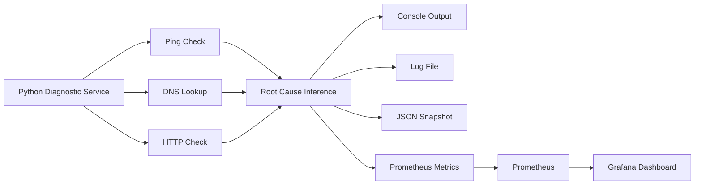

# 🌐 Network Diagnostics SRE


> Layered network diagnostics for SRE-style troubleshooting, with Prometheus metrics, Grafana dashboards, Dockerized execution, and machine-readable outputs.

---

## ✨ Overview

`Network Diagnostics SRE` is a troubleshooting tool designed to validate three operational layers:

- `NETWORK`: reachability through `ping`
- `DNS`: name resolution through `nslookup`
- `HTTP`: application availability through `requests`

The project exposes:

- structured logs
- JSON snapshots
- Prometheus metrics
- a preprovisioned Grafana dashboard
- Docker Compose infrastructure for local observability

---

## 🎯 Objectives

This repository aims to demonstrate a practical operational workflow:

- isolate failures by layer instead of checking only one symptom
- produce outputs for both humans and automation
- instrument the diagnostics process itself
- package the workflow so it can be reproduced locally with minimal setup

---

## 🧭 What It Detects

| Layer     | Purpose                     | Example Failure                     |
| --------- | --------------------------- | ----------------------------------- |
| `NETWORK` | Verifies basic reachability | Host unreachable, missing ICMP path |
| `DNS`     | Resolves hostnames to IPs   | Invalid domain, resolver problem    |
| `HTTP`    | Confirms service response   | Closed port, app down, timeout      |

### Example conclusions

- `ROOT CAUSE: NO ISSUES DETECTED`
- `ROOT CAUSE: DNS RESOLUTION FAILURE`
- `ROOT CAUSE: SERVICE NOT RUNNING OR PORT CLOSED`
- `ROOT CAUSE: NETWORK REACHABILITY FAILURE`

---

## 🚀 Features

- Layer-by-layer diagnostics for `NETWORK`, `DNS`, and `HTTP`
- Automatic root cause classification
- Multi-host execution through `TARGET_HOSTS`
- Colored console output for quick scanning
- Structured logs in `logs/diagnostico_red.log`
- JSON snapshot export in `diagnostico_red_output.json`
- Prometheus `/metrics` endpoint
- Grafana dashboard with automatic provisioning
- Dockerized application and observability stack
- Unit tests for parsers and diagnostic logic

---

## 🏗️ Architecture



---

## 📦 Repository Structure

```text
ejercicio_2_diagnostico_red_sre/
├── diagnostico_red.py
├── requirements.txt
├── Dockerfile
├── docker-compose.yml
├── .dockerignore
├── .gitignore
├── .env.example
├── README.md
├── observability/
│   ├── prometheus/
│   │   └── prometheus.yml
│   └── grafana/
│       ├── dashboards/
│       │   └── network_diagnostics_dashboard.json
│       └── provisioning/
│           ├── dashboards/
│           │   └── dashboard.yml
│           └── datasources/
│               └── prometheus.yml
├── tests/
│   └── test_diagnostico_red.py
└── logs/
```

---

## 🛠️ Tech Stack

| Component           | Role                          |
| ------------------- | ----------------------------- |
| `Python`            | Core diagnostics logic        |
| `requests`          | HTTP checks                   |
| `python-dotenv`     | Environment configuration     |
| `colorama`          | Terminal color output         |
| `prometheus_client` | Metrics export                |
| `Prometheus`        | Metrics scraping              |
| `Grafana`           | Visualization                 |
| `Docker`            | Packaging and reproducibility |

---

## 📋 Prerequisites

Before running the project, make sure you have:

- Python 3.13 or another compatible Python 3.x runtime
- Docker Desktop or Docker Engine with Compose support
- Internet access for public-host scenarios such as `google.com`

---

## ⚙️ Configuration

Create a local configuration file from the example:

```bash
copy .env.example .env
```

### Example `.env`

```env
TARGET_HOST=google.com
TARGET_HOSTS=google.com,localhost
INTERVAL=10
USE_HTTPS=true
USE_COLOR=true
REQUEST_TIMEOUT=5
ENABLE_METRICS=true
METRICS_PORT=8001
```

### Environment variables

| Variable          | Description                                              | Example                |
| ----------------- | -------------------------------------------------------- | ---------------------- |
| `TARGET_HOST`     | Single-host fallback when `TARGET_HOSTS` is not provided | `google.com`           |
| `TARGET_HOSTS`    | Comma-separated list of hosts                            | `google.com,localhost` |
| `INTERVAL`        | Seconds between runs; `0` executes once                  | `10`                   |
| `USE_HTTPS`       | Uses `https` instead of `http`                           | `true`                 |
| `USE_COLOR`       | Enables colored console output                           | `true`                 |
| `REQUEST_TIMEOUT` | Timeout in seconds for checks                            | `5`                    |
| `ENABLE_METRICS`  | Enables Prometheus endpoint                              | `true`                 |
| `METRICS_PORT`    | Port for `/metrics`                                      | `8001`                 |

---

## 💻 Run Locally

Install dependencies:

```bash
pip install -r requirements.txt
```

Run a single pass:

```bash
python diagnostico_red.py
```

Run continuously:

```bash
python diagnostico_red.py
```

Use a positive value in `INTERVAL` for repeated execution.

---

## 🐳 Run With Docker

### Build only the application

```bash
docker build -t sre-network-diagnostics .
```

### Run only the application

```bash
docker run --rm -p 8001:8001 --env-file .env --name sre-network-diagnostics sre-network-diagnostics
```

### Run the full observability stack

```bash
docker compose up --build
```

### Recreate after provisioning changes

```bash
docker compose down --volumes
docker compose up --build
```

> `Grafana` persists datasource and dashboard state. Recreate the stack after changing provisioning files.

---

## 📊 Observability Stack

The Docker Compose stack starts three services:

| Service               | Port   | Purpose                                  |
| --------------------- | ------ | ---------------------------------------- |
| `network-diagnostics` | `8001` | Diagnostics service and metrics endpoint |
| `prometheus`          | `9090` | Metrics scraping and query layer         |
| `grafana`             | `3000` | Dashboard visualization                  |

### Service endpoints

- App metrics: [http://localhost:8001/metrics](http://localhost:8001/metrics)
- Prometheus targets: [http://localhost:9090/targets](http://localhost:9090/targets)
- Grafana UI: [http://localhost:3000](http://localhost:3000)

### Grafana credentials

- User: `admin`
- Password: `admin`

### Provisioned Grafana assets

- Prometheus datasource with fixed UID
- Folder: `SRE Diagnostics`
- Dashboard: `Network Diagnostics SRE`

---

## 📈 Exported Metrics

The service exposes:

- `network_diagnostic_runs_total`
- `network_diagnostic_checks_total{target,layer,status}`
- `network_diagnostic_ping_latency_ms{target}`
- `network_diagnostic_http_status_code{target}`
- `network_diagnostic_root_cause_total{target,root_cause}`
- `network_diagnostic_run_duration_seconds`

### Dashboard panels

- `Diagnostic Runs`
- `Ping Latency by Target`
- `HTTP Status by Target`
- `Root Cause Distribution`
- `Check Rate by Target / Layer / Status`
- `Average Diagnostic Run Duration`

---

## 🧾 Outputs

Each execution produces several artifacts:

| Output                        | Purpose                              |
| ----------------------------- | ------------------------------------ |
| Console output                | Immediate human-readable diagnostics |
| `logs/diagnostico_red.log`    | Historical execution log             |
| `diagnostico_red_output.json` | Machine-readable latest snapshot     |
| `/metrics`                    | Prometheus scraping endpoint         |
| Grafana dashboard             | Time-series visualization            |

---

## 🧪 Example Scenarios

### Healthy path

```env
TARGET_HOST=google.com
INTERVAL=0
USE_HTTPS=true
```

### DNS failure

```env
TARGET_HOST=dominio-falso-123456.com
INTERVAL=0
USE_HTTPS=true
```

### HTTP failure

```env
TARGET_HOST=localhost
INTERVAL=0
USE_HTTPS=false
```

### Multi-host run

```env
TARGET_HOSTS=google.com,localhost,dominio-falso-123456.com
INTERVAL=0
USE_HTTPS=false
```

### Observability demo

```env
TARGET_HOSTS=google.com,localhost,dominio-falso-123456.com
INTERVAL=10
USE_HTTPS=false
ENABLE_METRICS=true
METRICS_PORT=8001
```

---

## ✅ Testing

Run the unit tests:

```bash
python -m unittest discover -s tests -v
```

### Test coverage focus

- Windows and Linux-style ping latency parsing
- `nslookup` answer parsing
- root cause prioritization
- healthy and failure outcomes

---

## 🧠 Engineering Notes

The implementation follows a few practical engineering principles:

- configuration is centralized through a `Config` dataclass
- HTTP calls reuse a single `requests.Session()`
- timeouts are configurable
- formatting, metrics, logging, and decision logic are separated
- timestamps are generated in UTC
- Grafana and Prometheus setup is stored as code, not configured manually

---

## 🧩 Spec-Driven Development

This repository was built around observable requirements rather than implementation detail alone. The goal of the methodology is simple: define what the system must do, how it should be validated, and what operators should expect before writing most of the code.

### 1. Define the problem statement

Write the problem in one precise sentence:

> The tool must identify whether a connectivity issue is happening at the network, DNS, or HTTP layer, and produce outputs that are useful both for humans and automation.

This statement acts as a boundary. It helps keep the project focused and prevents feature creep during implementation.

### 2. Write the operational specification first

Before coding, define the expected behavior in concrete terms:

- Given a healthy domain, the script must report `OK` for all three layers.
- Given a fake domain, the script must report DNS failure and skip HTTP.
- Given `localhost` with no service listening, the script must report HTTP failure after `NETWORK` and `DNS` succeed.
- Given multiple hosts, the script must process each host independently.
- Given metrics enabled, the service must expose `/metrics`.
- Given the observability stack enabled, Grafana must load the datasource and dashboard automatically.
- Given every run, the tool must append logs and overwrite the latest JSON snapshot.

This is the working contract of the system.

### 3. Define interfaces and configuration

Specify what an operator or developer is allowed to control:

- target hosts
- interval
- timeout
- protocol selection (`http` or `https`)
- color output
- metrics enablement and port
- dashboard stack execution through Docker Compose

This step matters because good specifications are not only about behavior; they are also about operability.

### 4. Define outputs before implementation

A spec should describe outputs as explicit interfaces, not as side effects discovered later.

This project exposes:

- console output for interactive troubleshooting
- `logs/diagnostico_red.log` for historical tracing
- `diagnostico_red_output.json` for machine-readable snapshots
- Prometheus metrics for observability systems
- Grafana dashboards for human-friendly operational visualization

Defining these outputs early makes the system easier to test, automate, and document.

### 5. Implement in thin vertical slices

A practical SDD workflow is to implement the system from top to bottom in small slices:

1. Ping layer
2. DNS layer
3. HTTP layer
4. Root cause inference
5. Logging
6. JSON export
7. Metrics
8. Dashboard provisioning
9. Documentation and tests

This keeps the feedback loop short and makes each increment observable.

### 6. Test from the specification, not from intuition

Each requirement should map to at least one validation scenario:

- `google.com` for the healthy path
- a fake domain for DNS failure
- `localhost` for application failure
- multiple targets for batch validation
- `/metrics` for Prometheus validation
- Grafana dashboard load verification
- unit tests for parsers and root cause logic

This is where the methodology becomes operational rather than theoretical.

### 7. Refine after the first end-to-end version

Once the workflow works from input to output, refine:

- naming
- function boundaries
- configuration handling
- metrics quality
- dashboard usefulness
- documentation clarity

This separates “working” from “publishable”.

### 8. Keep the repository aligned with the specification

Before publishing or sharing the repository, verify that:

- the README matches the real behavior
- `.env.example` reflects supported configuration
- the sample outputs are realistic
- Grafana provisioning paths and names are correct
- ignored files stay out of version control

This is an important SDD habit: the spec, the docs, and the implementation should not drift apart.

### 9. Suggested full workflow

Use this flow for future exercises or production prototypes:

1. Write the objective in one paragraph.
2. Define 3 to 6 behavioral requirements.
3. Define inputs, outputs, and constraints.
4. List validation scenarios before implementation.
5. Implement the smallest end-to-end version.
6. Validate with real scenarios.
7. Add observability and automation outputs.
8. Refactor for clarity and maintainability.
9. Update documentation so it matches actual behavior.
10. Publish only when code, docs, and operational checks agree.

### 10. How to execute SDD in practice

In practice, Spec-Driven Development means that you do not start with code. You start with a written operational contract, then you implement only what is needed to satisfy that contract, and finally you validate the result against the original expectations.

Below is a concrete way to execute the process.

#### Step A. Write a short spec before coding

Create a file such as `SPEC.md` and answer these questions:

- What problem does this tool solve?
- Who will use it?
- What inputs does it accept?
- What outputs must it produce?
- What behavior is considered success?
- What failure cases must be handled explicitly?

Example:

```md
# SPEC

## Problem
The tool must identify whether a failure is happening at the network, DNS, or HTTP layer.

## Inputs
- One host or multiple hosts
- HTTP/HTTPS selection
- Timeout
- Execution interval

## Outputs
- Console summary
- Log file
- JSON snapshot
- Prometheus metrics
- Grafana dashboard

## Acceptance criteria
- Healthy host returns OK for all layers
- Fake domain fails DNS and skips HTTP
- localhost without a service fails HTTP only
```

This is the first concrete artifact of SDD.

#### Step B. Convert the spec into acceptance checks

Before implementation, translate the spec into validations.

For this project, the acceptance checks could be:

| Scenario | Expected Result |
|---|---|
| `google.com` | `NETWORK`, `DNS`, and `HTTP` are `OK` |
| fake domain | `DNS` is `FAIL` and `HTTP` is `SKIPPED` |
| `localhost` with no service | `NETWORK` and `DNS` are `OK`, `HTTP` is `FAIL` |
| metrics enabled | `/metrics` is reachable |
| observability stack enabled | Grafana loads dashboard and datasource |

At this point you already know how the system will be judged, even before writing the implementation.

#### Step C. Break the work into thin slices

Create a task list that maps directly to the spec:

1. Implement `ping`
2. Implement `dns_lookup`
3. Implement `http_check`
4. Implement root cause inference
5. Add log output
6. Add JSON export
7. Add Prometheus metrics
8. Add Grafana provisioning
9. Add tests
10. Update documentation

This can live in:

- `GitHub Issues`
- `GitHub Projects`
- `Linear`
- `Jira`
- a simple checklist inside `SPEC.md`

The important part is that tasks are derived from the spec, not invented ad hoc while coding.

#### Step D. Implement each slice with a validation target

Each slice should be attached to one validation.

Examples:

- `ping` implementation validates against local console output and latency parsing tests
- `dns_lookup` validates against real domain and fake domain scenarios
- Prometheus validates against `/metrics`
- Grafana validates against dashboard load and visible time series

This avoids building features that are not testable.

#### Step E. Add executable validation

A good SDD workflow mixes manual and automated checks:

- manual scenario runs for end-to-end behavior
- unit tests for pure logic and parsers
- Docker Compose for reproducible integration validation
- Prometheus and Grafana for operational validation

For this project, that means:

```bash
python -m unittest discover -s tests -v
docker compose up --build
```

Then verify:

- `http://localhost:8001/metrics`
- `http://localhost:9090/targets`
- `http://localhost:3000`

#### Step F. Keep the documents synchronized

Once the implementation works, reconcile it with the documentation:

- update `README.md`
- update `.env.example`
- update `SPEC.md` if scope changed
- record design choices in ADRs or a `DECISIONS.md` file if needed

This is one of the most important parts of SDD: the written contract must stay aligned with the code.

#### Lightweight toolset for SDD

For an individual project, SDD can be executed with a very small toolkit:

- `README.md` for user-facing documentation
- `SPEC.md` for requirements and acceptance criteria
- `tests/` for executable validation
- terminal commands for manual scenario checks
- `Docker Compose` for reproducible integration

That is enough for many small engineering projects.

#### Team toolset for SDD

For collaborative or production-style work, useful tools include:

- `GitHub Issues` for requirements and scope items
- `GitHub Projects`, `Linear`, `Jira`, or `Trello` for slice tracking
- `SPEC.md` or `docs/spec/` for living specifications
- `ADR` files for design decisions
- `pytest` or `unittest` for automated validation
- `GitHub Actions` for CI
- `pre-commit` for repository hygiene
- `Docker` and `Docker Compose` for reproducible environments
- `Prometheus` and `Grafana` for observability validation

#### AI tools that can support SDD

AI tools can be useful in Spec-Driven Development, but they should support the specification process rather than replace it.

Good uses of AI in an SDD workflow include:

- helping draft the first version of a `SPEC.md`
- converting requirements into acceptance criteria
- generating implementation checklists from a written spec
- proposing test cases from expected behaviors
- refactoring code once the behavior is already validated
- improving documentation clarity and consistency
- reviewing code against the stated contract

Examples of AI tools that can be used in this process:

- `ChatGPT` or Codex-style assistants for drafting specs, generating checklists, and explaining tradeoffs
- GitHub Copilot for implementation acceleration once the contract is already defined
- AI-enabled IDE workflows for boilerplate generation, test scaffolding, and refactors
- LLM-based code review workflows to compare implementation against written requirements

Recommended usage by phase:

| SDD Phase | AI Can Help With | Human Responsibility |
|---|---|---|
| Problem definition | Drafting problem statements and clarifying scope | Approving scope and operational intent |
| Specification | Turning ideas into structured requirements | Deciding the actual contract |
| Acceptance criteria | Suggesting scenarios and edge cases | Choosing what truly matters |
| Implementation | Generating starter code and small slices | Ensuring correctness and maintainability |
| Testing | Proposing unit tests and validation cases | Verifying the tests are meaningful |
| Documentation | Polishing README and technical explanations | Ensuring docs match reality |

What AI should not replace:

- final acceptance decisions
- operational validation against real systems
- architectural tradeoff ownership
- production-readiness judgment
- the link between observed behavior and published documentation

In short, AI is most useful as a drafting, acceleration, and review layer. In SDD, the source of truth should still be the written specification plus the observed validation results.

#### Practical SDD execution for this repository

A concrete SDD execution flow for this repository would look like this:

1. Write `SPEC.md` with the three-layer diagnostic requirement.
2. Define the core scenarios: healthy host, DNS failure, HTTP failure, multi-host run.
3. Implement the diagnostic functions only after the scenarios are written down.
4. Add root cause inference and verify it against the written scenarios.
5. Add logs and JSON because the spec requires human and machine outputs.
6. Add Prometheus metrics because observability is an explicit requirement.
7. Add Grafana provisioning because dashboard visibility is part of the acceptance criteria.
8. Add unit tests to lock the parser and inference behavior.
9. Run the full stack with Docker Compose and verify targets, metrics, and dashboard.
10. Update `README.md` so the published repository matches the verified implementation.

That is a concrete SDD loop: specify, slice, implement, validate, reconcile, publish.

---

## 🚢 Publishing Checklist

Before pushing to GitHub, verify:

- `.env` is not committed
- `docker compose up --build` works from a clean checkout
- Prometheus target is `UP`
- Grafana dashboard loads and displays data
- unit tests pass
- logs and JSON outputs are excluded from version control
- the README reflects the actual implementation

---

## 🗺️ Roadmap

- Add traceroute support
- Add retry logic and latency aggregation
- Export per-host summary health gauges
- Add alert rules in Prometheus or Grafana
- Add CI for tests and linting

---

## 📄 License

Add a license file before publishing publicly if the repository will be shared outside personal use.

